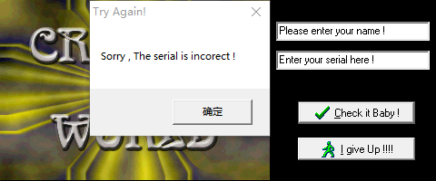
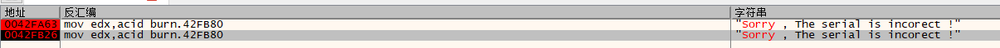

# 001-注册算法分析

## 一、工具和调试环境

- 动态调试工具：`x64dbg`
- 系统环境：`win10 1909`

## 二、分析`Serial/name`的算法

由于`Serial`里面就是一个字符串比较，没有啥算法，这里就不详细说了，大概就是通过搜索字符串`Failed`，就能定位到关键位置，`Serial`直接可以在栈中观察到，为：`Hello Dude!`。所以我们主要分析`Serial/name`的注册算法。

直接使用提示字符串验证，得到错误提示如下



那么我们直接搜索字符串`Sorry`，得知有两个地方使用该字符串，都设置上断点，然后重新验证，成功断在`0x0042F826`处，先分析这个，另一个后面再说



断下之后向上定位到关键算法如下

```asm
0042FA87     | 8B45 F0    		| mov eax,dword ptr ss:[ebp-10]      | [ebp-10]:"Please enter your name !" ; 获取name首地址
0042FA8A     | 0FB600     		| movzx eax,byte ptr ds:[eax]        | ; eax = name[0] 取出name的第一个字符存放在eax中
0042FA8D     | F72D 50174300     | imul dword ptr ds:[431750]         | 00431750:L")"  ; ")" aiscii码为 0x29  eax = name[0] * 0x29
0042FA93     | A3 50174300       | mov dword ptr ds:[431750],eax      | ; key = name[0] * 0x29
0042FA98     | A1 50174300       | mov eax,dword ptr ds:[431750]      | ; 
0042FA9D     | 0105 50174300     | add dword ptr ds:[431750],eax      |	; key = name[0] * 0x29 * 2
```

通过算法`key = name[0] * 0x29 * 2`算出`key`后，紧接着拼接得到`Serial`，格式为：`CW-key-CRACKED`

## 三、算法核心代码模拟

```c++
char* GetSerial(char* szName)
{
	static char szSerial[60] = {};
	if (strlen(szName) < 4)
	{
		MessageBox(NULL, "Name至少需要4位", "温馨提示", MB_OK);
		return nullptr;
	}

	int key = szName[0] * 0x29 * 2;
	
	sprintf(szSerial, "CW-%d-CRACKED", key);
	return szSerial;
}
```