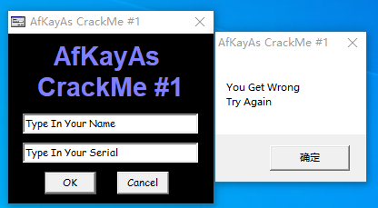
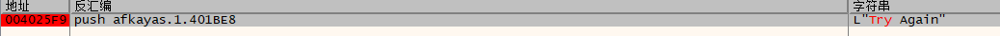
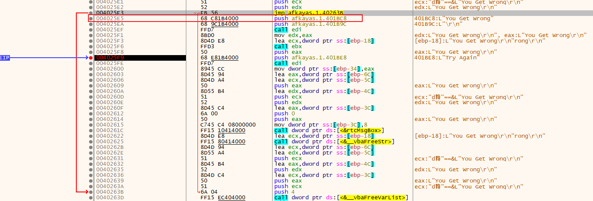
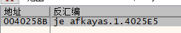
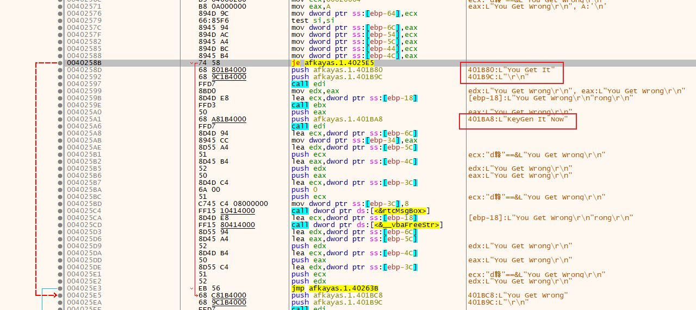
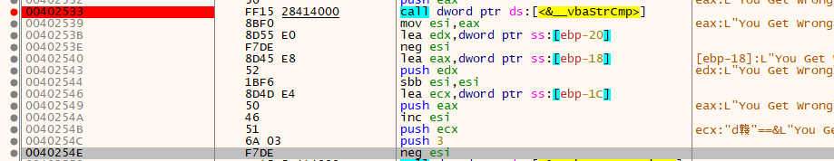
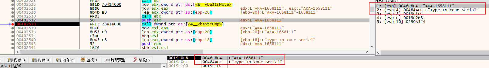
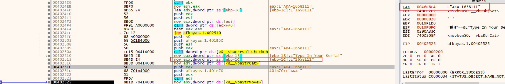
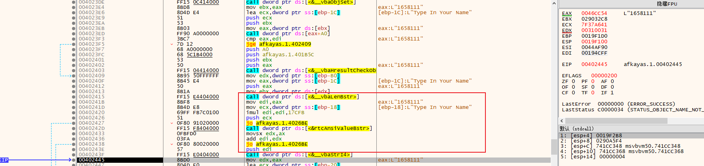

# 002-注册算法分析

## 一、工具和调试环境

- 动态调试工具：`x64dbg`
- 系统环境：`win10 1909`

## 二、分析`Serial/name`的算法

直接使用提示字符串验证，得到错误提示如下：



接下来使用`x64dbg`重新加载或者附加，然后直接搜索字符串`Try Again`，只有一处引用，就很`nice`。



双击跳到引用的地方，其中`edi`为`__vbaStrCat`函数地址，`ebx`为`__vbaObjSet`函数地址，这里就是错误提示弹窗的地方。往上看，可以发现一个`jmp`直接跳过错误提示弹窗的代码，那么`jmp`的下一行代码（下图红框）大概是从别的地方跳过来的，那么下面就查看什么地方跳到此处



选中该行，右键选中查找引用，然后选择选中的地址。可以看到有一处引用，这就很`nice`。



双击跳到引用的地方，可以发现`je`跳过的地方好像是正确提示弹窗代码，在此处下断点，然后运行程序，依旧使用提示字符串验证。断点触发，然后我们修改`ZF`标志位，再继续运行，发现正确提示弹窗出现。那么这个跳转就是关键跳转了。



接下来继续向上观察是影响`je`指令的指令，上面不远处就会发现`test si, si`，也就是说是通过`si`的值来影响跳转，当`si = 0`就提示错误，`si != 0 `就提示正确。想上继续查看`si`的值是怎么来的



如上图，`si`的值是`__vbaStrCmp`的返回值然后进行下面运算

```asm
; eax = __vbaStrCmp(str1, str2)的返回值, 相等返回0
mov esi, eax
neg esi				; 当 eax = 0 时， esi = 0, eax != 0 时，esi = -1
sbb esi, esi		; 当 eax = 0 时， esi = 0, eax != 0 时，esi = -1
inc esi			    ; 当 eax = 0 时， esi = 1, eax != 0 时，esi = 0
neg esi			    ; 当 eax = 0 时， esi = -1, eax != 0 时，esi = 0
; 即 str1 与 str2 相等时, esi = -1, 不相等时, esi = 0
```

由此我们只要让`str1`与`str2`相等即可，下面就在调用该函数的地方下个断点，运行，断点断下后，查看该函数的两个参数分别是什么



可以看出一个是我们输入的`Serial`，那么另一个应该就是需要输入的正确的`Serial`。接下来就需要找到正确`Serial`是怎么来的。

直接在函数头部下一个断点，然后一直单步观察寄存器和栈区的变化，看什么时候出现正确的`Serial`，最后在如下图的`0x00402525`处获取到正确的`Serial`



可以看到正确的`Serial`是拼接而成的，固定格式为：`AKA-XXX`，其中`XXX`是一串数字。接下来重复刚刚的操作，找到`XXX`首次出现的地方，见下图



`__vbaStrI4`函数是将长整型（4个字节）的数值转换为十进制表示的字符串，`XXX`就是`edi`转换后的，那么`edi`的值是如何来的呢？上图红框中就是`edi`的值的计算，也是我们要找的核心算法。

```asm
0040240F   | 8B45 E4                  | mov eax,dword ptr ss:[ebp-1C]           | [ebp-1C]:L"Type In Your Name" ; name的首地址
00402412   | 50                       | push eax                                | 
00402413   | 8B1A                     | mov ebx,dword ptr ds:[edx]              |
00402415   | FF15 E4404000            | call dword ptr ds:[<&__vbaLenBstr>]     | ; 获取 name 的长度
0040241B   | 8BF8                     | mov edi,eax                             | ; edi = strlen(name)
0040241D   | 8B4D E8                  | mov ecx,dword ptr ss:[ebp-18]           | [ebp-18]:L"Type In Your Name" ; name的首地址
00402420   | 69FF FB7C0100            | imul edi,edi,17CFB                      | ; edi = strlen(name) * 0x17CFB
00402426   | 51                       | push ecx                                | 
00402427   | 0F80 91020000            | jo afkayas.1.4026BE                     |
0040242D   | FF15 F8404000            | call dword ptr ds:[<&rtcAnsiValueBstr>] | ; 获取 name 的第一个字符的 ascii码值
00402433   | 0FBFD0                   | movsx edx,ax                            | ; edx = name[0]
00402436   | 03FA                     | add edi,edx                             | ; edi = strlen(name) * 0x17CFB + name[0]
00402438   | 0F80 80020000            | jo afkayas.1.4026BE                     |
0040243E   | 57                       | push edi                                |
0040243F   | FF15 E0404000            | call dword ptr ds:[<&__vbaStrI4>]       |
00402445   | 8BD0                     | mov edx,eax                             | eax:L"1658111"
```

首先获取`name`的长度，然后将其长度乘以`0x17CFB`，将运算的结果再加上`name`第一个字符的`ascii`码值就得到了`edi`的最终值：`edi = strlen(name) * 0x17CFB + name[0]`

## 三、算法核心代码模拟

```C++
char* GetSerial2(char* szName)
{
	static char szSerial[60] = {};

	int key = strlen(szName) * 0x17CFB + szName[0];

	sprintf(szSerial, "AKA-%d", key);
	return szSerial;
}
```

