# 003-去掉`nag`和注册算法分析

## 一、工具和调试环境

- 动态调试工具：`x64dbg`
- 系统环境：`win10 1909`

## 二、去掉`nag`

程序运行先会出现一个`nag`窗口，如下图所示。几秒之后才会出现真正的交互界面


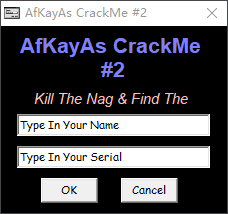

要去掉这个`nag`窗口，首先想到的是找到其创建`nag`窗口的位置，然后使其不执行就可以了，给创建窗口的`API`（`CreateWindowExA` 和`CreateWindowExW`）下断点，然后通过栈回溯找到创建`nag`窗口的位置，直接跳过此处创建窗口后面会报错说类不存在。

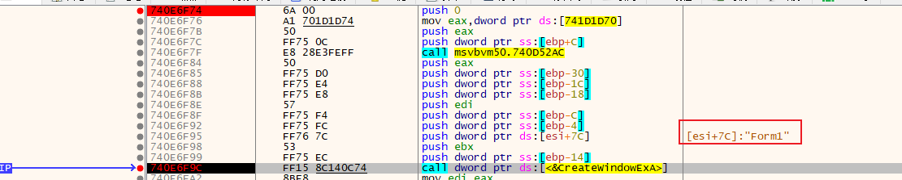

此时要么仔细分析是哪里导致的报错，或者继续向上回溯，找到一个跳过能正常接着运行的位置。如下图所示

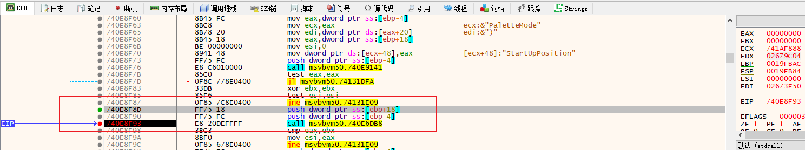

经过反复测试验证，只要第一次不执行`msvbvm50.740E6DB8`函数就行，该函数有两个参数，所以需要跳过`0x740E8F8D - 0x740E8F93`三条指令。现在`nag`弹窗是没有了，可是还是要等待几秒之后才会出现交互界面。

那么下面就是去掉等待时间，依旧是给`API`下断点，`SetTimer`下断点，然后栈回溯定位到其超时值（也就是定时器设定的触发时间）。

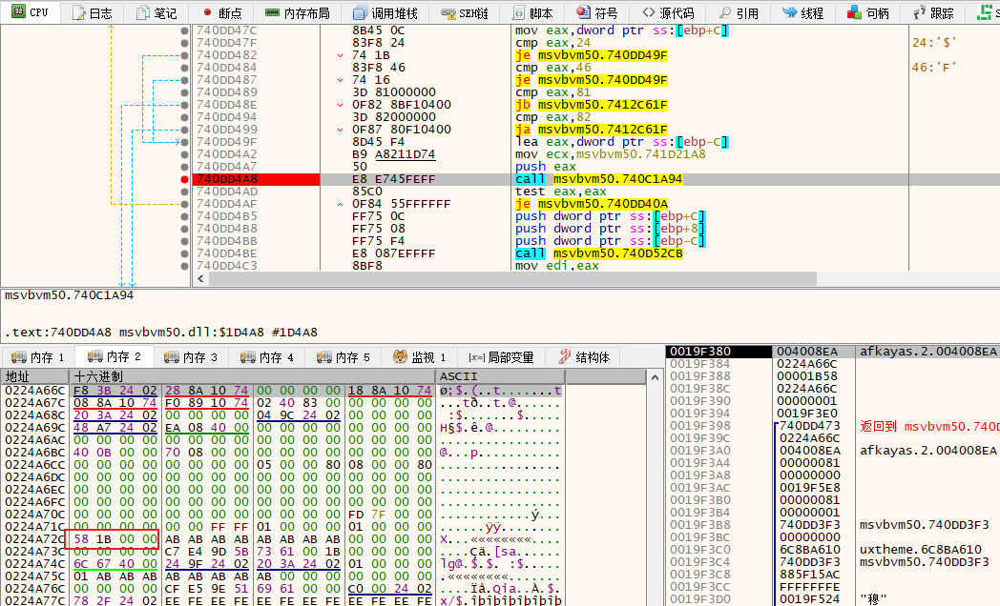

最终定位到来自于`0x224A66C + 0xC0`的位置，而`0x224A66C`是堆空间，所以需要继续跟踪，给`0x224A72C`下一个硬件写入断点

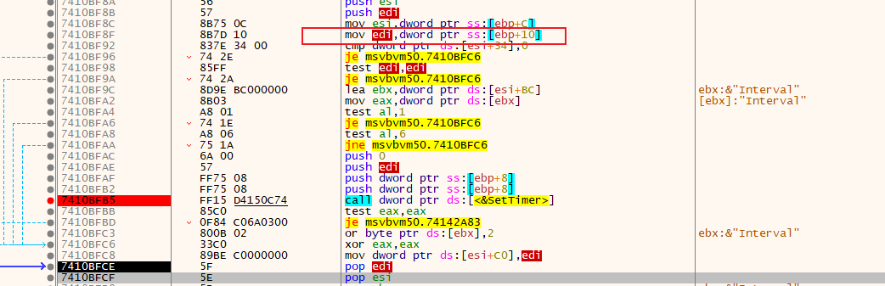

最后定位到上图的位置`0x7410BFC8`处`edi`就是超时值，可以看出`edi`是传进来的第三个参数，继续向上追溯，最终定位到超时值是存放在`0x00406775`处

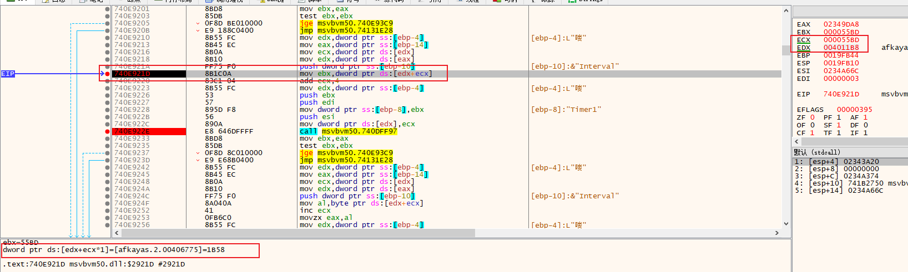

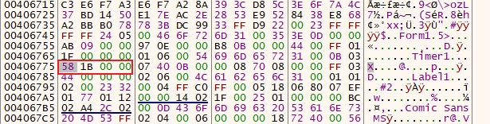

直接将此处修改为`0x1`然后打补丁即可。

到此就搞一段落，没有达到原本想的直接打补丁跳过创建`nag`窗口。后面在网上搜到了`C4`大法，原来还可以通过修改启动顺序来跳过。`C4`大法就不说了，链接奉上

[逆向破解之160个CrackMe —— 003 - 自己的小白 - 博客园 (cnblogs.com)](https://www.cnblogs.com/ndyxb/p/12458387.html)

[003-学习要学“张无忌” 装X可选“鸠摩智”（模拟初遇VB反汇编来钻研4C法） --重在逆向思维 (qq.com)](https://mp.weixin.qq.com/s/egAzH5N-muoxYj_4q_8lPQ)

## 三、分析`Serial/name`的算法

这次就不能使用默认提示字符串验证了，会报错。随便输入一对`name和Serial`(`Serial`必须是数字，否则就会报错)

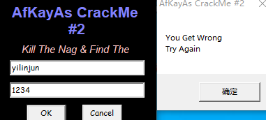

老套路，`x64dbg`重新加载，搜索字符串`Try Again`定位到关键点，然后不断回溯找到算法位置，下面是算法的部分

第一部分，获取`name`长度，其结果乘以`0x15B38`再加上`name`第一个字符的`ascii`码值

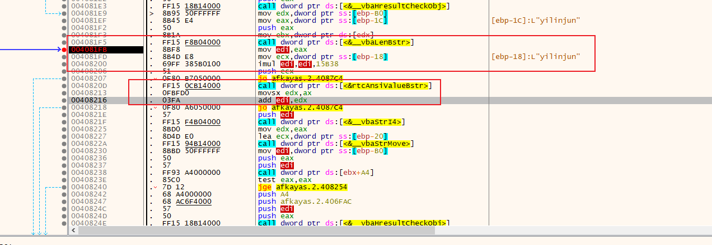

第二部分，`double`运算，第一部分的结果 + `2.0`

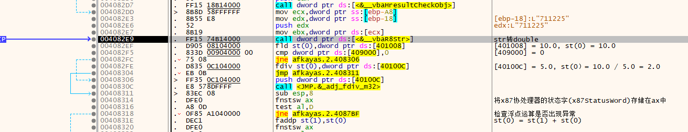

第三部分，依然是`double`运算，第二部分的结果乘以`3.0`，然后结果减去`2.0`

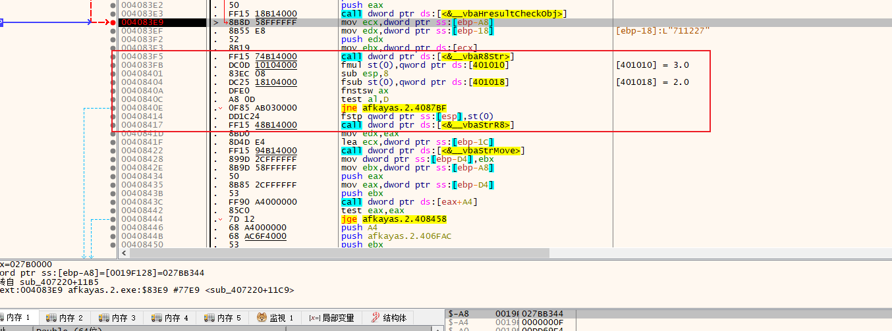

第四部分，依然是`double`运算，第三部分的结果加上`15.0`

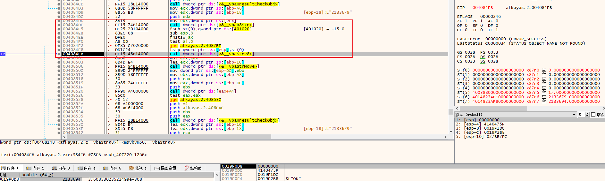

第五部分，依然是`double`运算，第四部分的结果除以`Serial`等于`1.0`就成功，也就是第四部分的结果就是正确的`Serial`，因为会使用`__vbaR8Str`转换`Serial`，所以`Serial`只能输入数字，否则会导致报错。

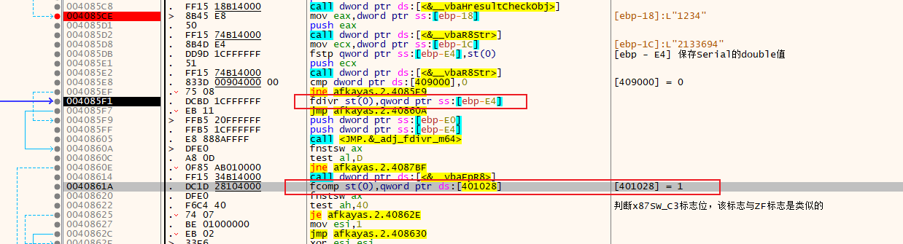

最后，总结的算法就是：`(strlen(name) * 0x15B38 + name[0] + 2.0) * 3.0 - 2.0 + 15.0`

## 四、算法核心代码模拟

```C++
char* GetSerial3(char* szName)
{
	static char szSerial[60] = {};

	int key = (strlen(szName) * 0x15B38 + szName[0] + 2.0) * 3.0 + 13.0;

	sprintf(szSerial, "%d", key);
	return szSerial;
}
```

