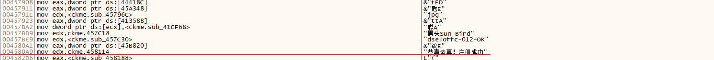
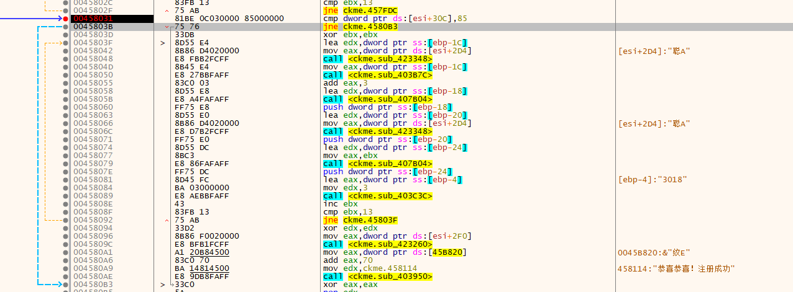
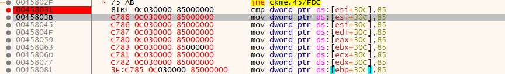
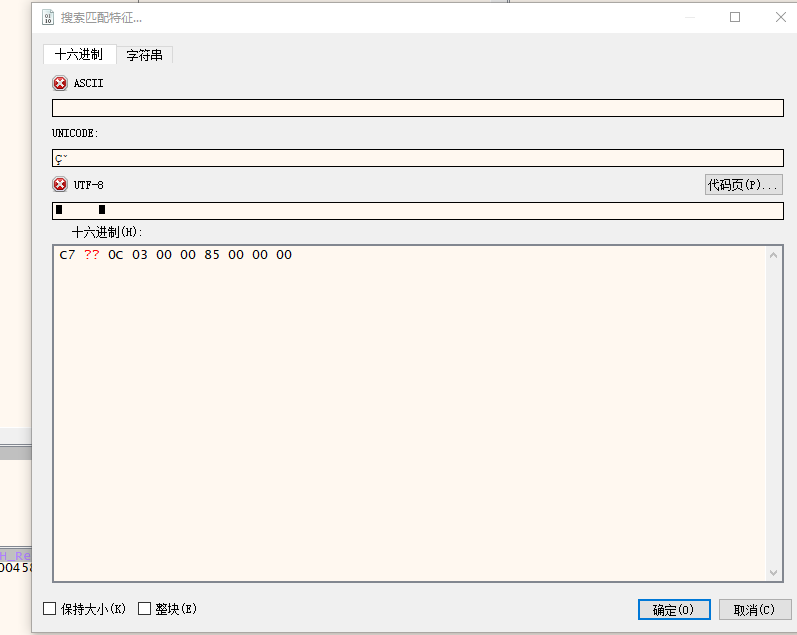
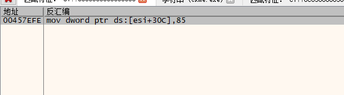
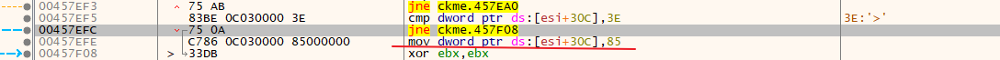
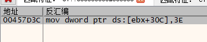
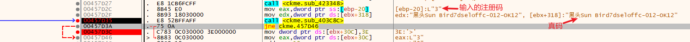
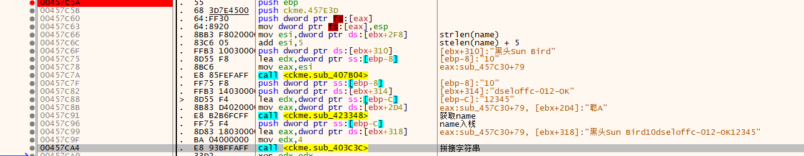

# 004-注册算法分析

## 一、工具和调试环境

- 动态调试工具：`x64dbg`
- 系统环境：`win10 1909`

## 二、分析用户名/注册码的算法

先随便输入用户名和注册码，然后验证。可惜无论点什么地方都没有错误提示。

因为对`Delphi`不了解，一开始按照`vc`的思路给`API`下断点，但是都不会断下来。查看了下字符串，发现并不多，翻了一下就能看到一个疑似成功注册的提示语。究竟是不是呢，直接跟过去瞅瞅就知道了





向上找到一个跳过该提示的跳转，经测试，为关键跳转。也就是会检测`esi + 30C`处的内存是否是`0x85`，如果是就注册成功。接下来就是寻找是哪里向该地址处写入了`0x85`，`esi`貌似是一个结构体或者对象首地址，那么写入的时候很可能也是一个寄存器加上偏移`0x30C`，如：`mov dword ptr [esi + 30C], 85`。但是寄存器很可能不一样，写出各寄存器的情况，获取通用特征码为：`C7?? 0C030000 85000000`



右键->搜索->当前模块->匹配特征，搜索特征码：`C7?? 0C030000 85000000`





很好，只有一个，我们跟过去看看，经过测试，`0x00457EFC`处为关键跳转，会检测`esi + 30C`处的内存是否是`0x3E`，如果是就会重新将该处内存赋值为`0x85`



按照之前的特征码搜索继续寻找，特征码：`C7?? 0C030000 3E000000`



也只有一个，就很`nice`，跟过去，可以发现是根据`sub_403C8C`函数的返回值来决定是否给上面结构体`0x30c`处赋值为`0x3E`的，经过调试，该函数类似字符串比较，将我们输入的注册码和真码进行比较。终于看见真码的身影了，接下来就一直溯源到真码的算法位置。



下面就是关键算法的部分，注册码为："黑头Sun Bird" + 用户名的长度 + "`dseloffc-012-OK`" + 用户名



## 三、算法核心代码模拟

```c++
char* GetSerial4(char* szName)
{
	static char szSerial[60] = {};

	char szTmp1[] = "黑头Sun Bird";
	char szTmp2[] = "dseloffc-012-OK";
	int key = strlen(szName) + 5;

	sprintf(szSerial, "%s%d%s%s", szTmp1, key, szTmp2, szName);
	return szSerial;
}
```

