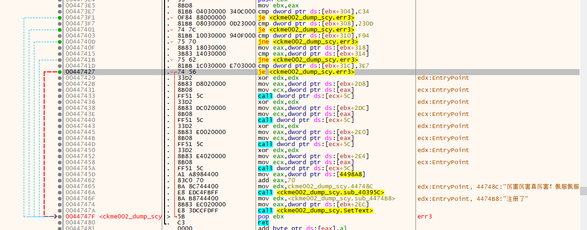

# 005-注册算法分析

## 一、工具和调试环境

- `PE`信息查看工具：`Die`
- 动态调试工具：`x64dbg`
- 反编译工具：`IDR(Interactive Delphi Reconstructor 01.04.2017)`
- 系统环境：`win10 1909`

## 二、分析用户名/注册码的算法

### 2.1脱壳

上`x64dbg`调试，发现入口点和`004`的不一样，应该是加了壳。使用`Die`工具查看是`upx`壳


这里就顺便熟悉一下脱壳，使用`esp`定律，运行完第一条指令`pushad`之后，在`esp`内存处下个硬件访问断点，然后运行程序


程序断下，下面会有一个大跳，跟进去就能发现熟悉的代码了（和之前`004`的差不多），这就是真正的入口点了


单步到真正的入口点，使用`Scylla`插件`dump`文件


修复dump文件的`iat`，还是在原始文件的`oep`处使用`Scylla`插件，先计算`IAT`范围，自动计算可能出错。然后获取导入函数。如果有识别错的，在其上右键然后选择删除，最后点击`Fix Dump`，然后选中要修复的`dump`文件进行`iat`修复


运行修复后的文件，可以运行。

### 2.2层层破防

使用`x64dbg`调试脱壳后的文件，然后直接中文搜索，快速预览，很快就看到了注册成功的关键信息


双击跟过去，可以初见作者`ajj`说的层层设防，一共有五个跳转，需要都满足条件才能注册成功，类似与游戏的五个关卡。接下来一关一关的通。



#### 2.2.1第一关`[ebx + 304]`

通关条件 `[ebx + 304]` 不能等于 `0xC34`

首先在该跳转处下一个断点，直接运行看看什么都不做的情况下是不是`0xC34`，经验证的确是`0xC34`。那么接下来就是找到给 `[ebx + 304]`赋值为`0xC34`的位置，使用`004`提到的指令特征码搜索法，特征码为：`C7?? 04030000 340C0000`。


搜索到了两条，直接双击一个跟过去看看


可以看出是需要一个文件，文件路径为：`X:\ajj.126.c0m\j\o\j\o\ok.txt`，文件内容为`0x446E14`处的字符串` ajj写的CKme真烂!`，由于后面两个无法输入，需使用二进制编辑，其二进制数据为：`20 61 6A 6A D0 B4 B5 C4 43 4B 6D 65 D5 E6 C0 C3 21 FF FF`。如果没有该文件或文件内容不对 `[ebx + 304]`就会被赋值为`0xC34`

直接使用`x64dbg`是识别不出`delphi`库函数的，这里需要使用到`IDR`工具，直接转到`0x446DB8`，可以看到库函数都识别处理了


由于我的没有`X`盘，而修改驱动器号会导致其它软件无法使用，这里直接打补丁将文件路径改为了：`E:\ok.txt`，然后在`E`盘下创建一个`ok.txt`，并编辑好内容。那么第一关就顺利通关。第一关通关之后，运行程序界面就会多出来一个编辑框，后文称为序列号编辑框


#### 2.2.2第二关`[ebx + 308]`

通关条件 `[ebx + 308]` 不能等于 `0x230D`

同第一关一样，使用指令特征搜索，此次指令特征为：`C7?? 08030000 0D230000`


一个，那就直接跟过去瞧瞧，同样借助`IDR`工具，可以查看该处是鼠标按键在注册按钮处被按下时的响应函数，其中`cl`为左键还是右键的标志，为0是左键，为1是右键


基本逻辑如下，其中`[ebx + 308]`的初始化在第一关的图片里就有


```c++
// [ebx + 308] 初始化为 0x28E
if([ebx + 308] == 0x230D)
{
    return;
}

if(右键按下)
{
    [ebx + 308] += 3;
    return;
}

if(左键按下 && [ebx + 308] >= 0x294)
{
	return;
}

[ebx + 308] = 0x230D;
return;
```

- 如果 `[ebx + 308]`处值已经为`0x230D`，则不做任何处理
- 如果 `[ebx + 308]`处值不为`0x230D`
  - 右键按下，其值加三
  - 左键按下，如果左键按下前没有按两次右键就会赋值为`0x230D`，如果之前已经按了两次右键就不做任何处理

第二关初始是通的，但是如果你看到注册按钮就左键按下了，那么恭喜你，成功的堵死了自己。至于右键按下的作用，就是一把钥匙，会用于帮助通关下面的关卡。现在先不管。

#### 2.2.3第三关`[ebx + 310]`

通关条件 `[ebx + 310]` 必须等于 `0xF94`

同第一关一样，使用指令特征搜索，此次指令特征为：`C7?? 10030000 940F0000`


一个，那就直接跟过去瞧瞧，同样借助`IDR`工具，可以查看该处是鼠标移动时的响应函数


可以看到要让[`ebx + 310] = 0xF94`需要满足三个条件，且需要按照顺序执行

1. 图片三(性相近)显示的时候，鼠标的x坐标必须大于`0xE2`，y坐标必须大于`0x12C`（移动鼠标从界面的右下角外部进入程序界面）
2. 图片二(性本善)显示的时候，鼠标的x坐标必须小于`0x17`，y坐标必须大于`0x12C`（移动鼠标从界面的左下角外部进入程序界面）
3. `[ebx + 30C] != 9` 

前面两步都是交由用户操作，那么剩下的就是解决第三步，`[ebx + 30C]`的初始值就是9，先搜索指令特征码：`C7?? 0C030000` 


很可惜，没找到，第三个是初始化的时候。既然不是立即数赋值，那么就试试寄存器赋值，例如`mov dword ptr ds:[ebx + 30C], eax`。指令特征码为：`89?? 0C030000` 


有一个，很棒。跟过去看看。同样借助`IDR`工具，可以查看该处是鼠标双击序列号编辑框时的响应函数


可以看出用户名的长度必须是3的倍数，序列号的第二个字符必须是'_'，第六个字符必须是','，且长度必须为8。`[ebx + 30C]`的值为用户名的长度加上当前程序所在的磁盘剩余空间大小再加上二，最后模四

```c++
ULARGE_INTEGER FreeBytesAvailable, TotalNumberOfBytes;

if (!GetDiskFreeSpaceExA(0, &FreeBytesAvailable, &TotalNumberOfBytes, NULL))
{
    OutputDebugStringA("获取磁盘数据失败\r\n");
    return nullptr;
}

FreeBytesAvailable.QuadPart += strlen(szName) + 2;
[ebx + 30C] = FreeBytesAvailable.QuadPart % 4;
```

总结下来，第三关通关攻略为：

1. 图片三(性相近)显示的时候，移动鼠标从界面的右下角外部进入程序界面
2. 图片二(性本善)显示的时候，移动鼠标从界面的左下角外部进入程序界面
3. 输入用户名，长度为3的倍数；输入序列号，长度必须为8，且第二个字符为'_'，第六个字符为','。输入完成后，双击序列号编辑框

致此，貌似第三关通了，然而验证时发现，序列号编辑框无法编辑。使用`IDR`查看窗体界面创建时的响应函数


可以看到创建的时候会将序列号编辑框设置为不可编辑，通过这里的指令获取指令特征，然后搜索指令特征：`???? F0020000`


看起来很多，不过依次点进去看很快就能发现`0x446FEA`处是我们要找的目标位置，结合`IDR`工具可以知道该处函数为图片显示框被双击时的处理函数


双击图片显示框中没有图片的地方，如果此时`[ebx + 308]`（`eax`与`ebx`为同一对象的首地址）处内容为`0x29D`就重新设置序列号编辑框可编辑，否则不做任何处理。这时就需要第二关的拾取的钥匙了，在注册按钮处右键按下`[ebx + 308]`值加3，只需要右键按下五次，即可是`[ebx + 308] = 0x29D`。

那么此时，第三关就算彻底通过。完整通关攻略如下

1. 图片三(性相近)显示的时候，移动鼠标从界面的右下角外部进入程序界面
2. 图片二(性本善)显示的时候，移动鼠标从界面的左下角外部进入程序界面
3. 右键按下注册按钮五次
4. 输入用户名，长度为3的倍数；输入序列号，长度必须为8，且第二个字符为'_'，第六个字符为','。输入完成后，双击序列号编辑框

#### 2.2.4第四关`[ebx + 314]/[ebx + 318]`

通关条件 `[ebx + 314]` 必须等于 `[ebx + 318]`

同第一关一样，使用指令特征搜索先搜索`[ebx + 314]`，此次指令特征为：`C7?? 14030000`


有五个，其中第一个是初始化，其余四个通过观察在一起，如下


借助`IDR`查看，处于鼠标移动处理函数中，同第三关一样，前面的已经在第三关处理了。`[ebx + 314]`的值根据`[ebx + 30C]`的值确定。而第三关的时候，我们已经知道`[ebx + 30C]`只能是0,1,2,3。

- `[ebx + 30C] = 0`时，`[ebx + 314] = 0x41`
- `[ebx + 30C] = 1`时，`[ebx + 314] = 0x3D`
- `[ebx + 30C] = 2`时，`[ebx + 314] = 0x34`
- `[ebx + 30C] = 3`时，`[ebx + 314] = 0xDF`

所以第三关完成时，`[ebx + 314]`的值会最终确定，且与计算机相关。那么用户怎么知道这个值呢。看上面那个图，当用户名为`ajj`时，第三关完成的时候会显示`[ebx + 30C]`的值


接下来就是找到`[ebx + 318]`的赋值操作，同样使用指令特征搜索


其中第一条为初始化操作，初始化为0。依次跟过去看，结合`IDR`工具


其余类似就不放了，最后`[ebx + 318]`(初始值为0)的计算规则是

- 图片一(人之初)，左键单击加2，右键单击加`0x11`
- 图片二(性本善)，左键单击加3，右键单击加`0x13`
- 图片三(性相近)，左键单击加5，右键单击加`0x17`
- 图片四(习相远)，左键单击加7，右键单击加`0x1B`

总结一下，第四关的通关攻略：第三关的时候输入的用户名使用`ajj`（如果不开辅助，只能使用该用户名才能知道确定的值，不过最后会附上注册机算法，就可以使用其他合规的用户名了），这样就能确定该台计算机`[ebx + 30C]`的值。

- 值为0时，图片四(习相远)鼠标右键单击2下, 左键单击1下, 图片一(人之初)鼠标左键单击2下
- 值为1时，图片四(习相远)鼠标右键单击2下，左键单击1下
- 值为2时，图片二(性本善)鼠标右键单击2下, 图片四(习相远)鼠标左键单击2下
- 值为3时，图片四(习相远)鼠标右键单击8下, 鼠标左键单击1下

- 图片一(人之初)，左键单击加二，右键单击加`0x11`

#### 2.2.5第五关`[ebx + 31c]`

通过条件 `[ebx + 31C] != 0x3E7`

同第一关一样，使用指令特征搜索，此次指令特征为：`C7?? 1C030000 E7030000` 


跟进去查看，同时借助`IDR`了解到这是注册按钮点击处理函数


只要注册按钮被点击就会将`[ebx + 31C]`的值设为`0x3E7`，所以注册按钮不能点击，只要点击就不会注册成功了。鼠标右键不会触发点击事件，鼠标左键才会触发点击事件。即注册按钮无论何时都不能使用鼠标左键操作。

至此，所有的关卡就都通关了。

## 三、算法核心代码模拟

```c++
char* GetSerial5(char* szName)
{
	OutputDebugStringA("1.先创建一个文件, 路径为：'X:\\ajj.126.c0m\\j\\o\\j\\o\\ok.txt'\r\n");
	OutputDebugStringA("2.文件内容为：20 61 6A 6A D0 B4 B5 C4 43 4B 6D 65 D5 E6 C0 C3 21 FF FF (使用二进制编辑)\r\n");
	OutputDebugStringA("3.运行程序，鼠标右键单击注册按钮5次\r\n");
	OutputDebugStringA("4.然后双击图片显示框中没有图片显示的地方\r\n");
	OutputDebugStringA("5.用户名的长度必须是3的倍数。序列号第二个字符必须是'_',第六个字符必须是',',\
		长度必须为8。用户名和序列号输入完成之后双击序列号编辑框\r\n");
	OutputDebugStringA("6.当出现图片3时，移动鼠标从界面的右下角外部进入程序界面\r\n");
	OutputDebugStringA("7.当出现图片2时，移动鼠标从界面的左下角外部进入程序界面\r\n");
	OutputDebugStringA("8.注意，不能鼠标左键单击注册按钮，否则就会一直失败\r\n");
	OutputDebugStringA("9.用户名为 'ajj'会有特殊效果\r\n");

	int nNameLen = strlen(szName);

	if (((nNameLen + 3) % 3))
	{
		OutputDebugStringA("用户名的长度必须是3的倍数\r\n");
		return nullptr;
	}

	ULARGE_INTEGER FreeBytesAvailable, TotalNumberOfBytes;

	if (!GetDiskFreeSpaceExA(0, &FreeBytesAvailable, &TotalNumberOfBytes, NULL))
	{
		OutputDebugStringA("获取磁盘数据失败\r\n");
		return nullptr;
	}
	
	FreeBytesAvailable.QuadPart += nNameLen + 2;

	int nKey1 = 0;

	int nKey2 = 0;
	// 图一，左键单击 + 2， 右键单击 + 0x11
	// 图二，左键单击 + 3， 右键单击 + 0x13
	// 图三，左键单击 + 5， 右键单击 + 0x17
	// 图四，左键单击 + 7， 右键单击 + 0x1B

	switch (FreeBytesAvailable.QuadPart % 4)
	{
	case 0:
	{
		nKey1 = 0x41;
		OutputDebugStringA("10.图4鼠标右键单击2下, 左键单击1下, 图1鼠标左键单击2下\r\n");
		break;
	}
	case 1:
	{
		nKey1 = 0x3D;
		OutputDebugStringA("10.图4鼠标右键单击2下，左键单击1下\r\n");
		break;
	}
	case 2:
	{
		nKey1 = 0x34;
		OutputDebugStringA("10.图2鼠标右键单击2下, 图4鼠标左键单击2下\r\n");
		break;
	}
	case 3:
	{
		nKey1 = 0xDF;
		OutputDebugStringA("10.图4鼠标右键单击8下, 鼠标左键单击1下\r\n");
		break;
	}
	}
}
```

