# 006-注册算法分析

## 一、工具和调试环境

- `PE`信息查看工具：`Die`
- 动态调试工具：`x64dbg`
- 反编译工具：`IDR(Interactive Delphi Reconstructor 01.04.2017)`，`IDA 7.6`
- 系统环境：`win10 1909`

## 二、分析用户名/注册码的算法

### 2.1运行程序

作者意图是让我们将`OK`和`Cancella`两个按钮隐藏。其中`OK`按钮是不可点击的。需要填写`Nome`和`Codice`。

### 2.2查壳

用`Die`查壳，没有加壳，是`Delphi`程序，貌似是`Delphi 4`，记住版本后面会用到

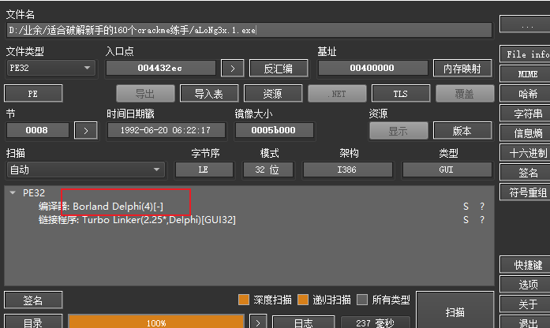

### 2.3详细分析

通过`005`的分析，我们了解到了`Delphi`的改变控件有效状态的`api`为：`SetVisible`，更具体点为：`TControl.SetVisible`。那么下面就借助`IDR`，找到该`API`的地址

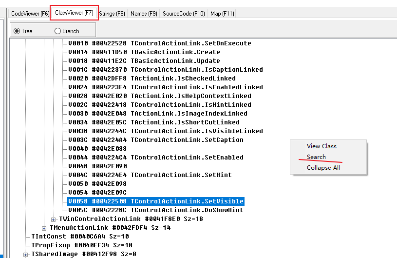

如上图，选择`ClassViewer`视图，然后在该视图空白处右键`Search`，然后如下图，在弹出的查找框中寻找`SetVisible`

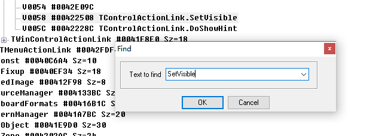

找到如下地址

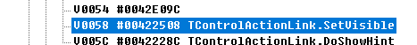

双击，会跳转到`CodeViewer`视图，显示该函数代码，可以看到`TControl.SetVisible`

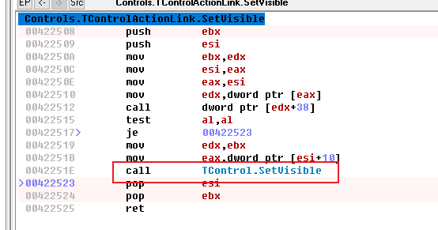

双击进去，就可以得到`TControl.SetVisible`的地址了，如下图为：`0x004231B0`

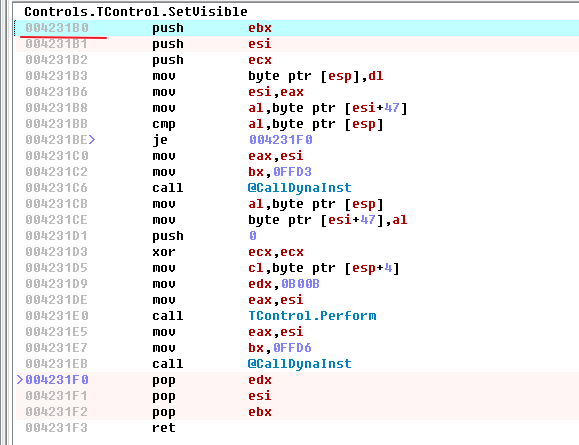

但是如果`x64dbg`在该地址下断点，并不能找到关键地方。只有使用正确的方法使`Cancella`隐藏才是我们想要的触发，问题的关键是我们就是在寻找正确的方法。

那么怎么办呢？接下来就要请出我们的新伙伴`IDA`了。

使用`IDA`打开程序，然后打开签名视图，如下图或者直接使用快捷键`Shift + F5`

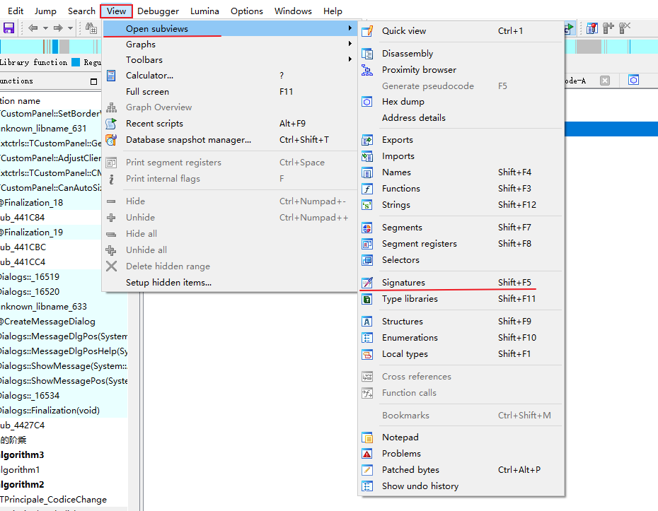

在签名视图空白处右键选择添加一个新的签名，或者使用快捷键`Ins`，然后选择`Delphi 4`（之前`Die`查到的版本）

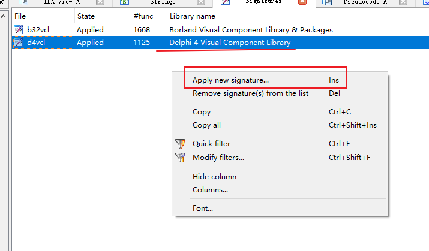

在汇编视图中查找之前的函数(`TControl.SetVisible`)地址：`0x004231B0`

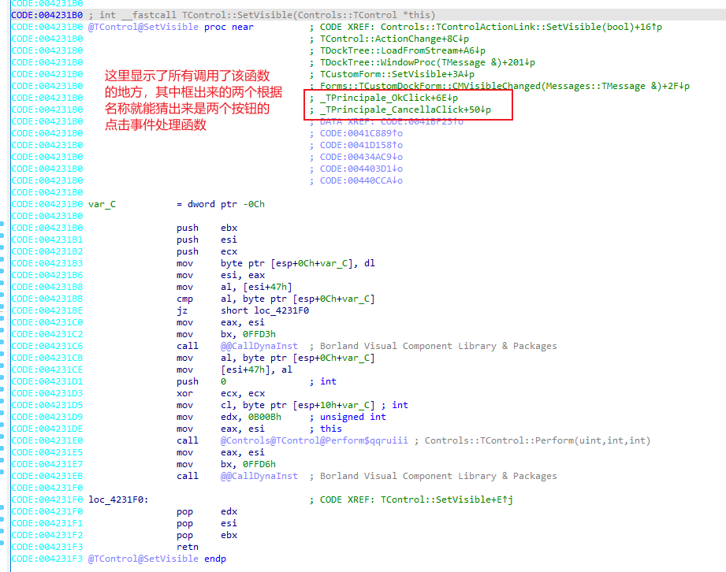

由于`OK`按钮目前是不可点击的，那么我们先看`Cancella`按钮的点击事件，双击过去。然后和`IDR`对照看，如有不懂，可以先看上一篇`005`

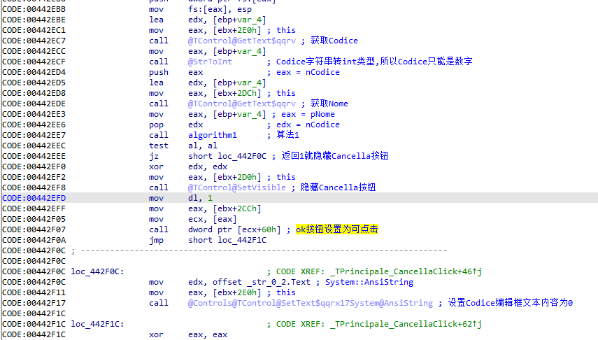

可以看出关键的地方在于`0x442EE7`处的`call algorithm1(名字是我改的，算法1)`函数调用，当该函数返回非0时(其实返回值不是0就是1)，`Cancella`按钮会被隐藏且`ok`按钮变为可点击。如果返回为0时，`Codice`编辑框内容重新设置为0。

接下来就进入算法1函数中，看如何使其返回1。关键算法如下

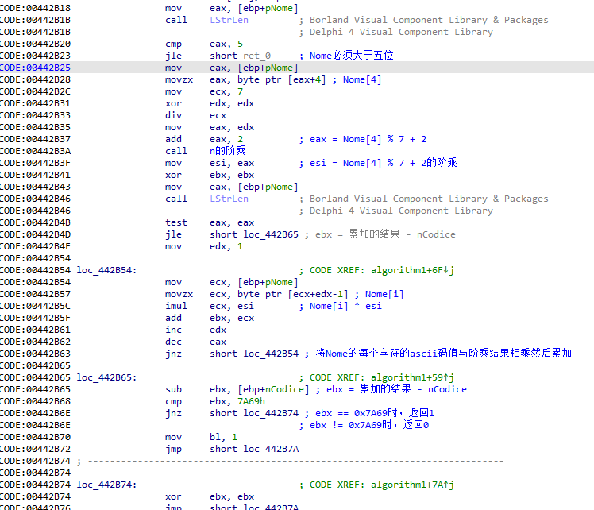

`Nome`必须大于五位，且`Codice`和`Nome`满足以下关系就返回1，否则返回0。

`Codice`与`Nome`的关系：`Nome`的第5个字符的`ASCII`码值模7，再加上2。其结果的阶乘与`Nome`的每一个字符的`ASCII`码值相乘，所有乘积累加。新的结果减去`0x7A69`，就是`Codice`的内容。算法代码如下

```c++
char* GetSerial6_1(char* szNome)
{
	static char szCodice[60] = {};

	int nNomeLen = strlen(szNome);
	if (nNomeLen <= 5)
	{
		printf("Nome 需要大于五位\r\n");
		return nullptr;
	}

	int nTmp = szNome[4] % 7 + 2;
	int nFactorial = 1;
	for (int i = 1; i <= nTmp; ++i)
	{
		nFactorial *= i;
	}

	int sum = 0;
	for (int i = 1; i <= nNomeLen; i++)
	{
		sum += szNome[i - 1] * nFactorial;
	}

	sum = sum - 0x7A69;

	sprintf(szCodice, "%d", sum);
	return szCodice;
}
```

现在成功的隐藏了`Cancella`按钮，且`ok`按钮可点击了。接下来就是隐藏`ok`按钮了。还记得前面查找的`OK`按钮的点击处理函数中也调用了控件隐藏的函数。那么就看看`ok`按钮的点击处理函数

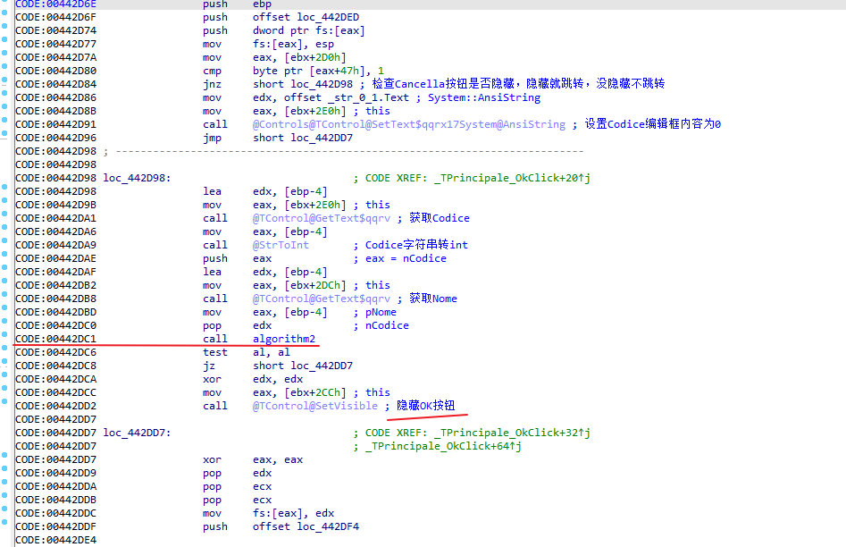

可以看出关键的地方在于`0x442DC1`处的`call algorithm2(名字是我改的，算法2)`函数调用，当该函数返回非0时(其实返回值不是0就是1)，`OK`按钮会被隐藏。如果返回为0时，不做处理。和前面`Cancella`按钮点击处理函数差不多。不过该处理函数，会首先检测`Cancella`按钮是否被隐藏，如果没隐藏就会将`Codice`编辑框内容设置为0，然后返回。只有`Cancella`被隐藏了。才会执行前面关键代码。

接下来就进入算法2函数中，看如何使其返回1。关键算法如下

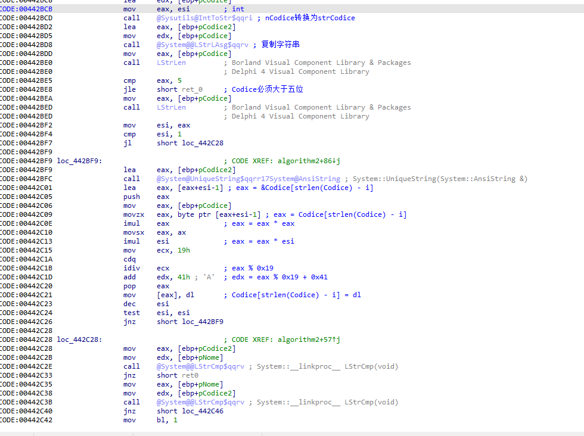

`Codice`必须大于五位，且`Codice`和`Nome`满足以下关系就返回1，否则返回0。

`Codice`与`Nome`的关系：`Codice`的数字转换为字符串，然后将该字符串的每个字符的`ascii`码值进行平方计算，计算结果再乘以该字符的字符串中的位数（从1开始）得到新的结果，再用新的结果模`0x19`，最后再加上`0x41`。得到的新的字符串和`Nome`字符串相同就返回1，否则返回0。

算法代码如下：

```c++
char* GetSerial6_2(char* szCodice)
{
	static char szNome[60] = {};

	int nCodiceLen = strlen(szCodice);
	if (nCodiceLen <= 5)
	{
		printf("Codice 需要大于五位\r\n");
		return nullptr;
	}

	char chTmp = '0';
	for (int i = nCodiceLen; i != 0; i--)
	{
		szNome[i - 1] = (szCodice[i - 1] * szCodice[i - 1] * i) % 0x19 + 0x41;
	}

	return szNome;
}
```

