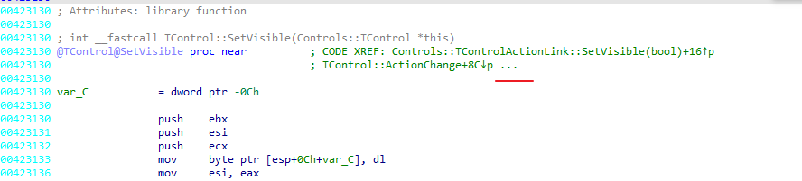
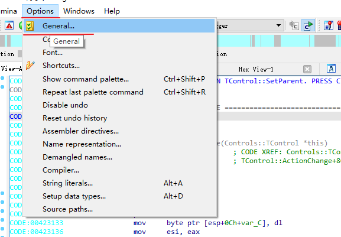
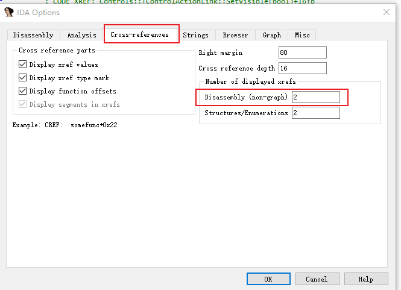
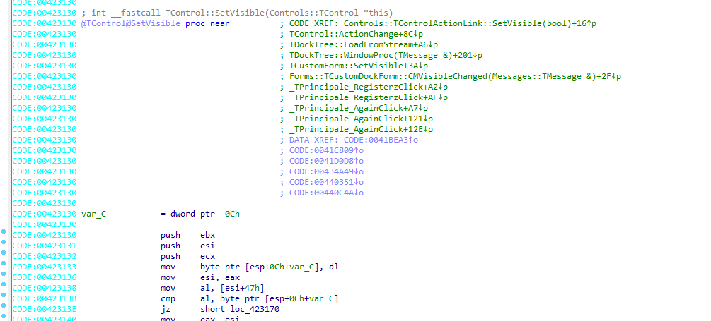
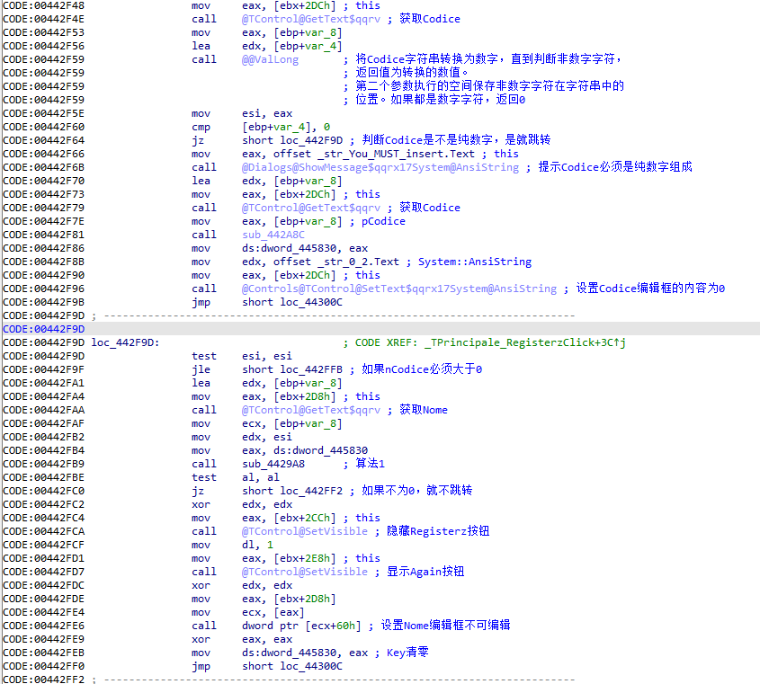
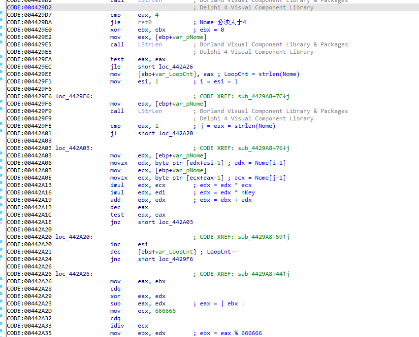
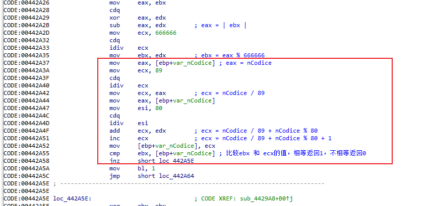
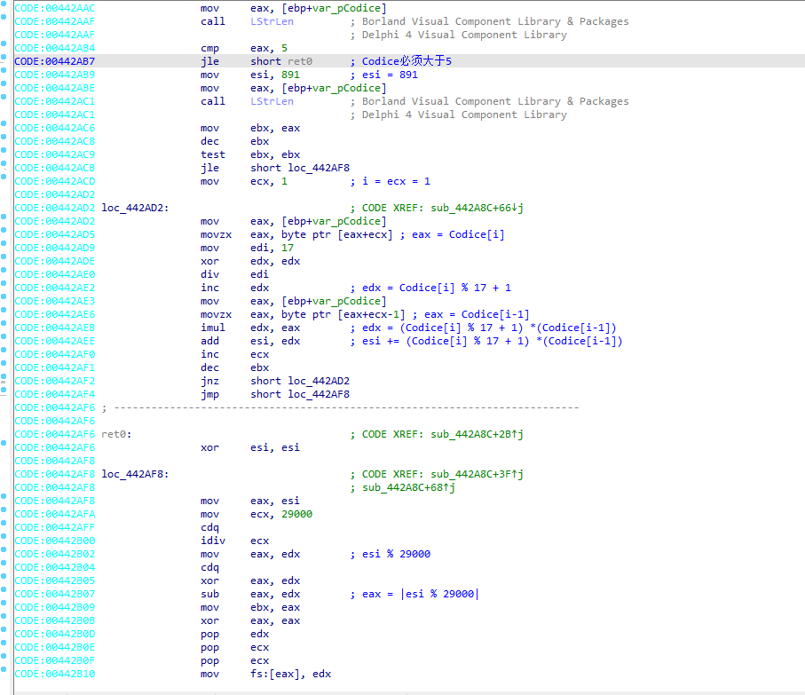

# 007-注册算法分析

## 一、工具和调试环境

- `PE`信息查看工具：`Die`
- 动态调试工具：`x64dbg`
- 反编译工具：`IDR(Interactive Delphi Reconstructor 01.04.2017)`，`IDA 7.6`
- 系统环境：`win10 1909`

## 二、分析用户名/注册码的算法

### 2.1运行程序

作者意图是让我们将`Ringzer0`背景上的按钮隐藏。与006相比，貌似少了一个`Cancella`按钮（不在`Ringzer0`背景图上）。但是其实也是要隐藏两个按钮。

### 2.2查壳

用`Die`查壳，没有加壳，是`Delphi`程序，貌似是`Delphi 4`，和006一样，这里就不贴图了。

### 2.3详细分析

具体找到关键位置的方法和`006`是一致的，这里也不多讲了，有不清楚的，可以先去看看`006`。不过其中有个小地方，可能有朋友会不知道。这里补充以下



如上图红线画的省略号，表示后面还有引用没有展示出来。选择`Options->General`，在弹出的`Options`弹窗中选择`Cross-references`，然后修改下图红框中的位置，数字表示要显示的行数





直接修改为20，如果不够可以继续加。可以看到没有省略号了，全部引用都显示出来了。



按照`006`的方法找到隐藏`Registerz`按钮的关键位置位于`Registerz`点击处理函数中，分析如下



和`006`几乎一样的结构，通过算法1（`sub_4429A8`）函数的返回值来控制是否隐藏。不为0就隐藏`Registerz`按钮并会显示一个新的`Again`按钮。

算法1函数的参数有三个

- 第一个参数是`dword_445830`保存的值(后文称`key`)
- 第二个参数是`Codice`字符串转换为的`int`数值
- 第三个参数是`Nome`字符串缓冲区的首地址

通过`x64dbg`调试，其中`key`的值默认是0。如果`Codice`的内容含有非数字，则`key`的值会被`sub_442A8C`的返回值覆盖。暂时先不管`key`的问题

我们看看算法1





算法还原如下，根据该算法，如果`key`的值为0，则`Codice`无论输入啥也无法满足。所以`key`的值需要改变，就需要分析`sub_442A8C`函数

```c++
int GetSerial7_1(int nKey, int nCodice, char* szNome)
{
	int nNomeLen = strlen(szNome);
	if (nNomeLen <= 4)
	{
		return 0;
	}

	int sum = 0;
	for (int i = 1; i <= nNomeLen; i++)
	{
		for (int j = nNomeLen; j > 0; j--)
		{
			sum += szNome[i - 1] * szNome[j - 1] * nKey;
		}
	}

	sum = abs(sum) % 666666;

	if ((nCodice / 89) + (nCodice % 80) + 1 != sum)
	{
		return false;
	}

	return true;
}
```

`sub_442A8C`函数的分析如下



算法还原如下：

```c++
int GetKey7_1(char* szCodice)
{
	int nCodiceLen = strlen(szCodice);
	if (nCodiceLen <= 5)
	{
		return 0;
	}

	int sum = 891;
	for (int i = 1; i < nCodiceLen; i++)
	{
		sum += (szCodice[i] % 17 + 1) * (szCodice[i - 1]);
	}

	return abs(sum % 29000);
}
```

算法就分析完了，后面新的`Again`按钮的算法也是这两个算法，这里就不多说了。

总结下操作流程就是

1. `Codice`编辑框输入一个非纯数字的字符串（需大于5位），如`"abcdef"`，然后点击`Registerz`按钮
2. 通过`GetKey7_1`的算法获取`key`值
3. `Nome`编辑框输入一串字符串（需大于4位），`Codice`的值通过`GetSerial7_1`获得（需要穷举）。然后点击`Registerz`按钮
4. `Registerz`即隐藏了，`Again`隐藏的步骤就是把1-3的步骤重复一遍。