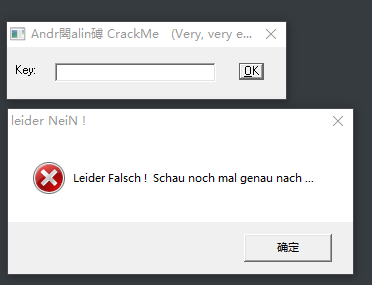
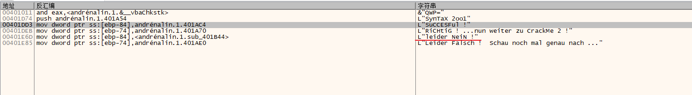
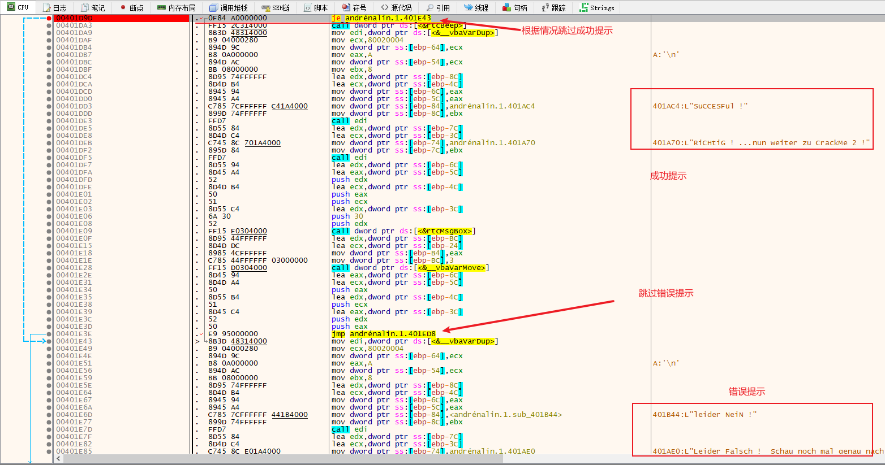
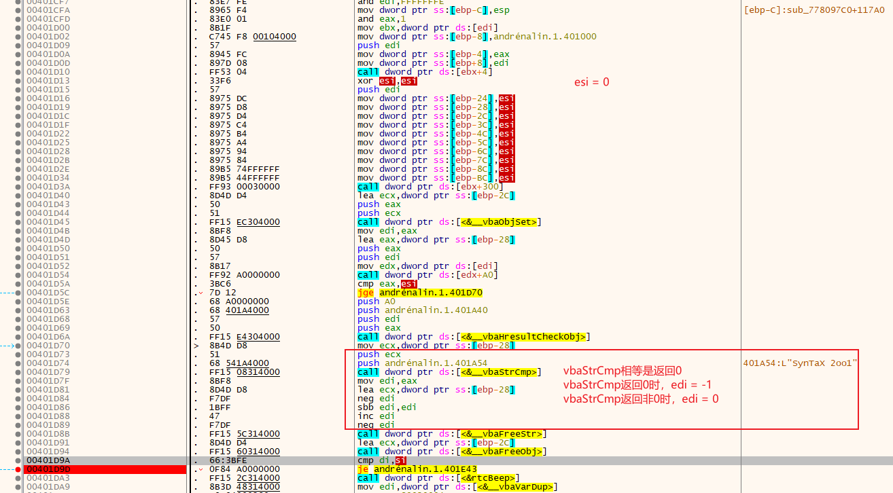

# 008-注册算法分析

## 一、工具和调试环境

- `PE`信息查看工具：`Die`
- 动态调试工具：`x64dbg`
- 系统环境：`win10 1909`

## 二、分析用户名/注册码的算法

### 2.1运行程序

只有一个`key`编辑框和`ok`按钮，直接点击`ok`按钮会报错



### 2.2查壳

用`Die`查壳，无壳，`vb`程序

### 2.3详细分析

既然有提示字符串，直接上`x64dbg`搜索字符串



字符串很少，不过几乎都是我们需要的，直接双击跟过去看看。



向上不远处就能找到疑似关键跳转，通过测试确定`0x401D9D`处就是关键跳转。



貌似`vb`程序的比较都是上图红框中的格式，这个地方的推算已经在`002`中讲过，如下

```asm
; eax = __vbaStrCmp(str1, str2)的返回值, 相等返回0
mov esi, eax
neg esi				; 当 eax = 0 时， esi = 0, eax != 0 时，esi = -1
sbb esi, esi		; 当 eax = 0 时， esi = 0, eax != 0 时，esi = -1
inc esi			    ; 当 eax = 0 时， esi = 1, eax != 0 时，esi = 0
neg esi			    ; 当 eax = 0 时， esi = -1, eax != 0 时，esi = 0
; 即 str1 与 str2 相等时, esi = -1, 不相等时, esi = 0
```

也就是`ecx`指向的缓冲区中的字符串和`SynTaX 2oo1`一样，猜测可能`ecx`指向的缓冲区就是我们输入的`key`，经测试确实如此。那么该`cm`就结束了。

没有什么算法。`key`就是一串固定的字符串`SynTaX 2oo1`