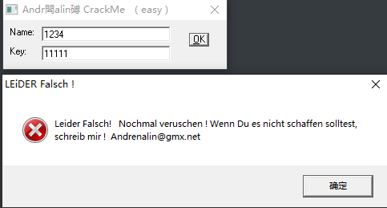
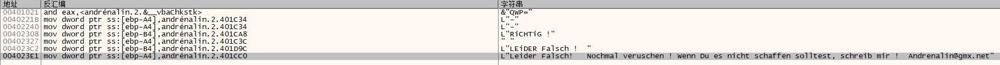
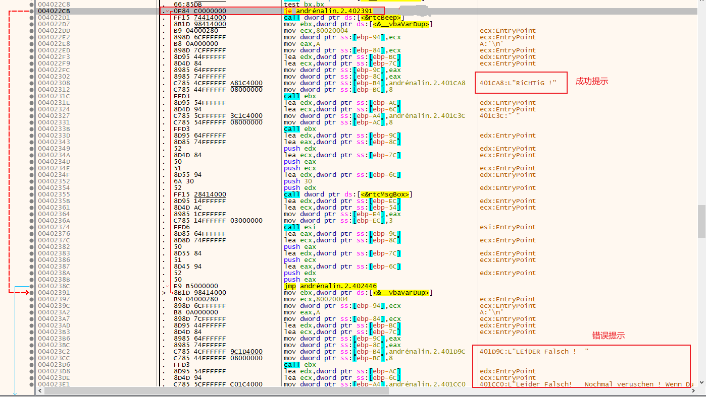
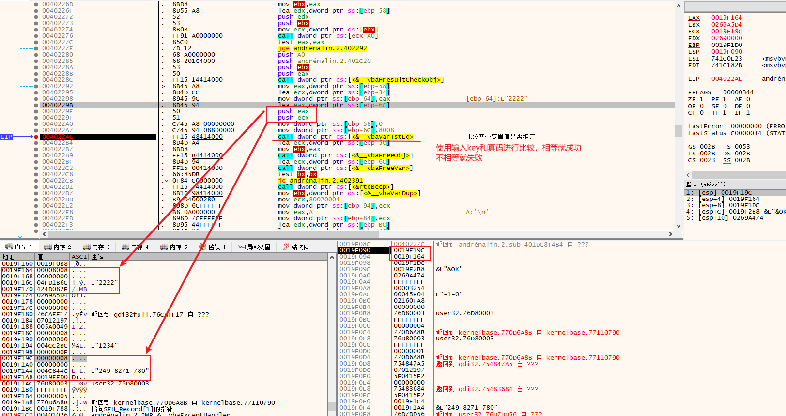
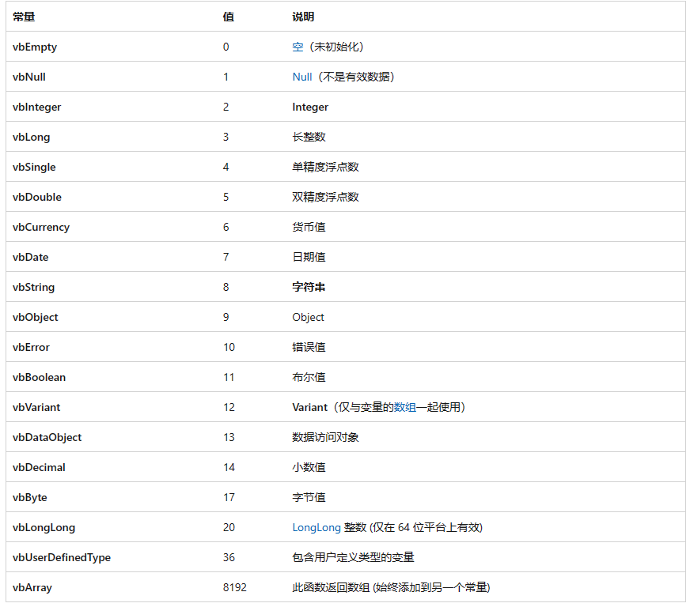
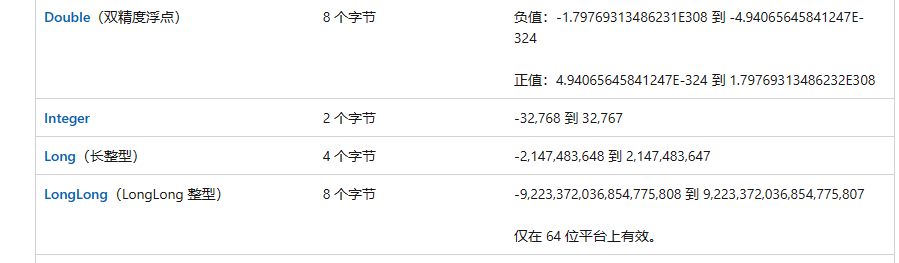
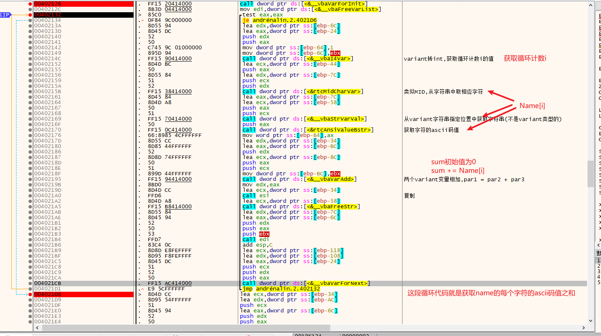
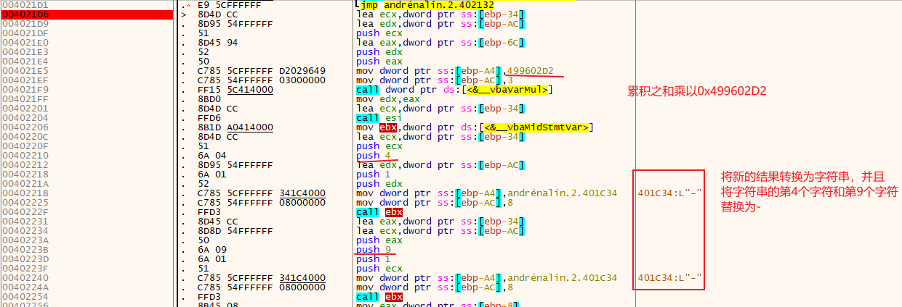

# 009-注册算法分析

## 一、工具和调试环境

- `PE`信息查看工具：`Die`
- 动态调试工具：`x64dbg`
- 系统环境：`win10 1909`

## 二、分析用户名/注册码的算法

### 2.1运行程序

输入`Name`和`Key`后，直接点击`ok`按钮会报错



### 2.2查壳

用`Die`查壳，无壳，`vb`程序

### 2.3详细分析

既然有提示字符串，直接上`x64dbg`搜索字符串。和`008`一样，基本都是关键字符串



直接选中失败提示字符串双击跟过去看看，和`008`基本类型，向上很快就能找到关键跳转



向上继续找，可以发现`vbaVarTstEq`函数的返回值来确定是否跳转。该函数是比较两个`Variant`变量值是否相等。我们在该函数下个断点，然后随便输入`name`和`key`，点击`ok`。成功断在该断点



分析该函数参数，可以看到一个是我们输入的`key`，另一个就是计算后的真码（也就是我们需要输入的正确的`key`）。

`vbaVarTstEq`函数的两个参数是两个指向`Variant`类型的指针，`Variant`类型的结构如下

````c++
struct Variant
{
    short varType;		// 说明data数据的真实类型
    short res1;
    short res2;
    short res3;
    long long data;		// 8个字节，具体数据使用几个字节根据varType的值决定，为字符串时使用4个字节存储保存字符串的缓冲区的首地址
}
````

类型如下，来自[VBA) (VarType 常量 | Microsoft Learn](https://learn.microsoft.com/zh-cn/office/vba/language/concepts/getting-started/vartype-constants)



其中注意为`vbEmpty`类型时表示尚未被初始化的 `Variant` 变量（已分配初始值）。 包含 `vbEmpty` 的 `Variant` 用于数值上下文时为 0；用于字符串上下文时为零长度字符串 ("")。

长整型是占4个字节，如下



搞清楚了`Variant`类型结构下面的分析就好分析了。

通过不断的回溯找到算法位置如下，由于大部分使用`Variant`变量进行运算，所以单步调试的时候无法直接看到变量数据，每次还需要自己在内存中查看





`key`的算法：`name`的每个字符的`ascii`码值相加之和的结果乘以`1234567890`(`0x499602D2`)获得的新结果转换为字符串，然后将其中的第4个字符和第9个字符替换为'-'。

## 三、算法核心代码模拟

```C++
char* GetKey8(char* szName)
{
	static char szKey[60] = {};

	int nSum = 0;

	for (int i = 0; i < strlen(szName); i++)
	{
		nSum += szName[i];
	}

	long long  llKey = ((long long)1234567890 * nSum);

	sprintf(szKey, "%lld", llKey);

	szKey[3] = '-';
	szKey[8] = '-';

	return szKey;
}
```

## 四、`API`总结

### `vbaVarMove`

```c++
// 移动(可以理解成剪切)，pVariant2 移动到 pVariant1
// 移动之后 pVariant2 就不可用了, 其类型会变为vbEmpty，数据没变
// 参数一通过 ecx 传递，参数二通过 edx 传递
// 返回移动后的地址, 即 pVariant1
Variant* vbaVarMove(Variant* pVariant1, Variant* pVariant2);
```

### `vbaLenVar`

```c++
// 获取变体字符串(变体类型为字符串)长度
// 获取 pVariant2 中字符串的长度，结构保存到 pVariant1 中
// 通过栈传递参数
// 返回获取的长度，也是变体指针，即 pVariant1
Variant* vbaLenVar(Variant* pVariant1, Variant* pVariant2);
```

### `vbaVarForInit`

```c++
// for循环的初始化(循环计数初值(i = start)，循环结束边界(i < end)，循环步长(i += step))
// pForI,     pForEnd, pForStep 是传出参数
// pStart,    pEnd,    pStep    是传入参数
// 搭配vbaVarForNext使用
// 通过栈传递参数
// 成功返回1，失败暂时不知
int vbaVarForInit(Variant* pForI, Variant* pForEnd, Variant* pForStep, 
                   Variant* pStart, Variant* pEnd, Variant* pStep);
```

### `vbaVarForNext`

```c++
// 循环下一个(会检查是否还能继续循环，如果不能就返回0，能就返回1)
// 如果还能循环就会修改循环计数, 即 pForI 指向的变体的值
// 通过栈传递参数
// 成功返回1，失败返回0
int vbaVarForNext(Variant* pForI, Variant* pForEnd, Variant* pForStep);
```

### `vbaI4Var`

```c++
// 将变体(需要是长整型变体或Integer变体)转换为4个字节的整型数值
// 通过栈传递参数
int vbaI4Var(Variant* pVariant1);
```

### `rtcMidCharVar`

```c++
// 从变体(字符串类型)字符串中指定位置开始获取指定个字符组成的新字符串
// Variant* pSubStr 接收获取的字符串
// Variant* pSrcStr 源字符串
// int nIdx 	    开始的位置(从1开始计算)
// Variant* pCnt	取多少个字符
// 通过栈传递参数
// 返回新的字符串(变体), 即 pSubStr
Variant* rtcMidCharVar(Variant* pSubStr, Variant* pSrcStr, int nIdx, Variant* pCnt);
```

### `vbaStrVarVal`

```c++
// 将变体转换为字符串
// wchar** pStr 如果变体类型为整型，浮点型等数值型就先将其转换为字符串，该参数就是接收转换后的字符串的首地址
//  		   如果变体类型为字符串类型，则该参数忽略
// Variant* pVariant1	待转换的变体指针
// 通过栈传递参数
// 返回转换后的字符串首地址
wchar* vbaStrVarVal(wchar** pStr, Variant* pVariant1);
```

### `rtcAnsiValueBstr`

```c++
// 获取字符串第一个字符的ascii码值
// wchar* pStr 字符串首地址
// 通过栈传递参数
// 返回转换后的字符串首地址
short rtcAnsiValueBstr(wchar* pStr);
```

### `vbaVarAdd`

```c++
// 两个变体相加
// pVariant1 = pVariant2 + pVariant3
// 通过栈传递参数
// 返回存储结果的变体的地址, 即 pVariant1
Variant* vbaVarAdd(Variant* pVariant1, Variant* pVariant2, Variant* pVariant3);
```

### `vbaVarMul`

```c++
// 两个变体相乘
// pVariant1 = pVariant2 * pVariant3
// 通过栈传递参数
// 返回存储结果的变体的地址, 即 pVariant1
Variant* vbaVarMul(Variant* pVariant1, Variant* pVariant2, Variant* pVariant3);
```

### `vbaMidStmtVar`

```c++
// 修改字符串指定位置指定长度的字符
// Variant* pReplaceStr 用于替换的字符串
// int pCnt	替换的个数
// int nIdx 开始的位置(从1开始计算)
// Variant* pSrcStr  源字符串
// 通过栈传递参数
// 返回值未知
void vbaMidStmtVar(Variant* pReplaceStr, int nCnt, int nIdx, Variant* pSrcStr);
```

### `vbaVarTstEq`

```c++
// 比较两个变体是否相等(类型和数据都要一致)
// 通过栈传递参数
// 相等返回-1，不相等返回0
int vbaVarTstEq(Variant* pVariant1, Variant* pVariant2);
```

