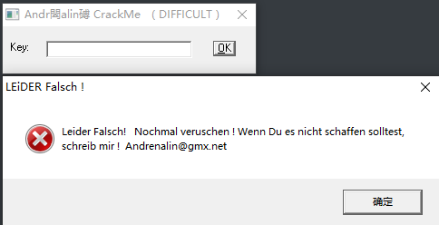
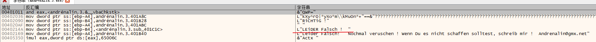
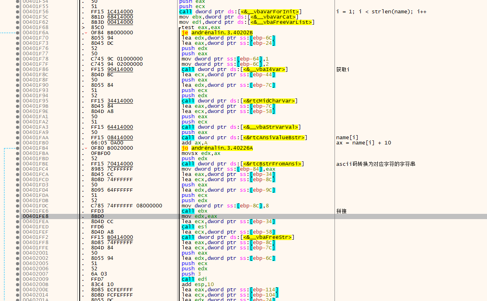
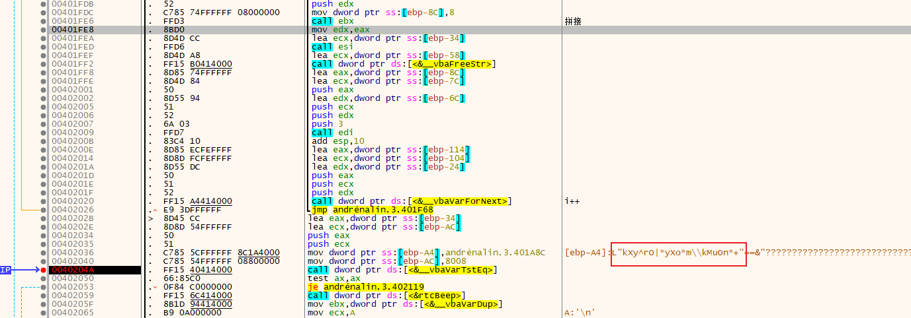

# 010-注册算法分析

## 一、工具和调试环境

- `PE`信息查看工具：`Die`
- 动态调试工具：`x64dbg`
- 系统环境：`win10 1909`

## 二、分析用户名/注册码的算法

### 2.1运行程序

只有一个`key`编辑框和`ok`按钮，直接点击`ok`按钮会报错



### 2.2查壳

用`Die`查壳，无壳，`vb`程序

### 2.3详细分析

依然是搜索字符串，直接上`x64dbg`搜索字符串



然后跳转，基本情况和`009`一样，下面直接放出关键算法位置



其中用到的函数基本在`009`我们已经熟悉过了，又添加了两个函数`rtcBstrFromAnsi`和`vbaVarCat`，前一个是将`ascii`字符转换为字符串，后一个是拼接字符串，只不过参数是变体。

这段代码就是将`name`的每个字符的`ascii`值加10，组成一个新的字符串



将之前新组成的字符串与上图红框框出来的字符串相比较，如果相等，就提示成功。

所以真正的`key`只要将上面框出来的字符串每个字符的`ascii`值减10，就可以得到一个固定的`key`值，为：`aNoThEr oNe cRaCkEd !`

## 三、算法核心代码模拟

```C++
char* GetKey9()
{
	char szName[] = "kXy^rO|*yXo*m\kMuOn*+";

	static char szKey[60] = {};

	for (int i = 0; i < strlen(szName); i++)
	{
		szKey[i] = szName[i] - 10;
	}

	return szKey;
}
```

## 四、`API`总结

### `rtcBstrFromAnsi`

```c++
// 字符转换为字符串
// 栈传参
char* rtcBstrFromAnsi(char ch);
```

### `vbaVarCat`

```c++
// 变体字符串拼接(pVariant1 = pVariant2 + pVariant3)
// pVariant2 和 pVariant3 字符串拼接在一起，结果放在 pVariant1中
// 返回值等于 pVariant1
Variant* vbaVarCat(Variant* pVariant1, Variant* pVariant2, Variant* pVariant3);
```

