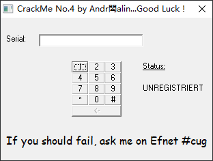
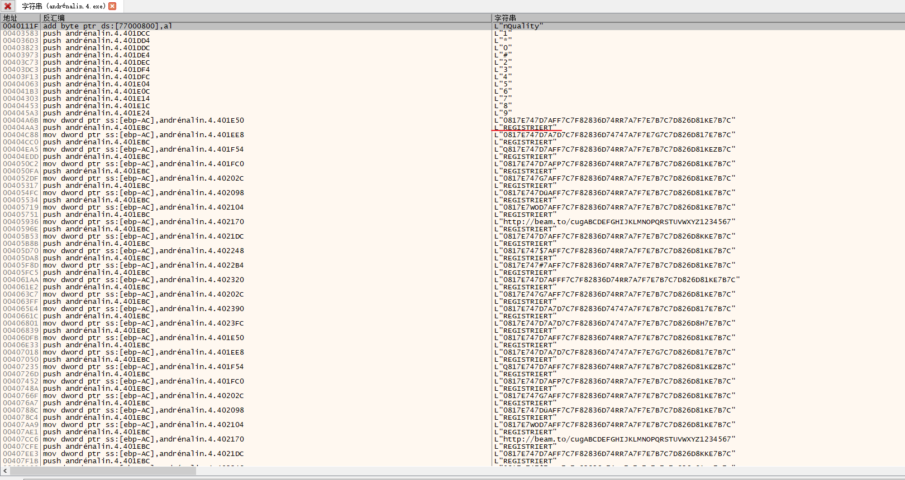
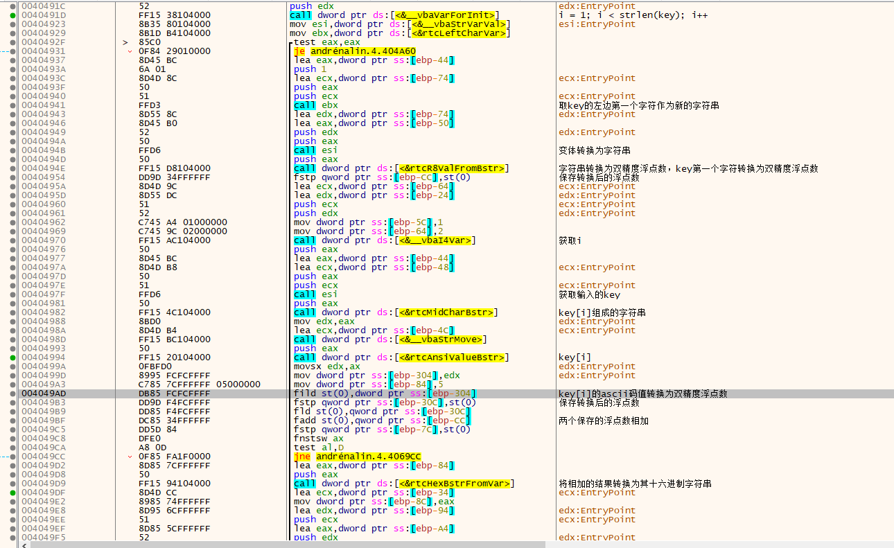
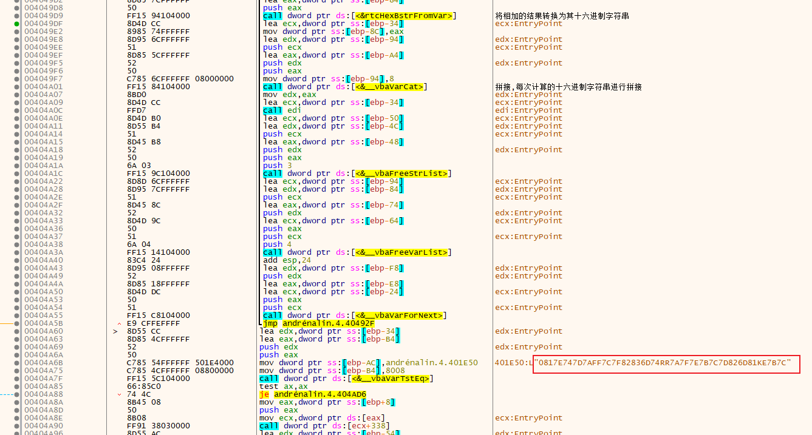
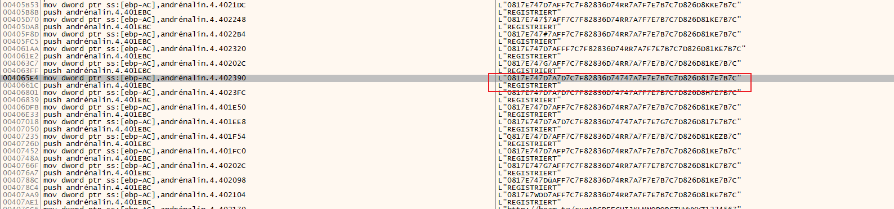
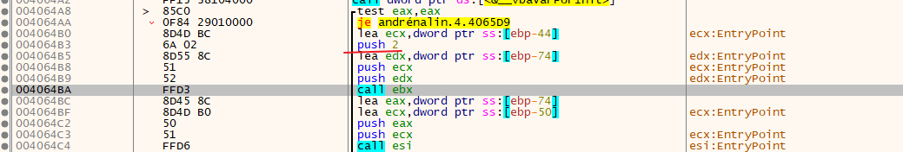

# 011-注册算法分析

## 一、工具和调试环境

- `PE`信息查看工具：`Die`
- 动态调试工具：`x64dbg`
- 系统环境：`win10 1909`

## 二、分析用户名/注册码的算法

### 2.1运行程序

通过点击按钮输入`Serial`，正确的话状态就会变为`REGISTRIERT`



### 2.2查壳

用`Die`查壳，无壳，`vb`程序

### 2.3详细分析

老办法，上`x64dbg`，搜索字符串看看



好家伙，没看到`UNREGISTRIERT`，倒是看到一大堆`REGISTRIERT`。看了几个，验证过程大致一样，于是就选择了第一个跟进去看。





基本算法就是：将输入的每个字符的`ascii`码值和首个字符相加(必须是数值)，然后将相加之和得到的结果转换为十六进制的字符串，最后拼接在一起，组成的字符串（首次拼接的时候，拼接到‘0’后面）和上图框出的字符串一样就注册成功。

由于最后的字符串每个字符必须是十六进制数，所以每个取值范围只能在`0~F`之间。上图中的明显不符合，有`R,K`。



转到引用界面，经过一番删选，只有上图框出来的那一个合适。为：`0817E747D7A7D7C7F82836D74747A7F7E7B7C7D826D817E7B7C`。此处又经过一番折腾，发现无论如何都无法满足。最后跟进到上面唯一正确提示的地方（之前分析的是第一个的，粗略看了下以为全部都一样），找到其算法位置



发现唯一的差别是取的前两个字符相加，不是之前的首个字符。

至此，基本算法确定：将输入的每个字符的`ascii`码值和前两个字符相加(必须是数值)，然后将相加之和得到的结果转换为十六进制的字符串，最后拼接在一起，组成的字符串（首次拼接的时候，拼接到‘0’后面）和上图框出的字符串一样就注册成功。

## 三、算法核心代码模拟

```C++
char* GetKey10()
{
	// 0817E747D7A7D7C7F82836D74747A7F7E7B7C7D826D817E7B7C
	char szName[] = "817E747D7A7D7C7F82836D74747A7F7E7B7C7D826D817E7B7C";

	static char szKey[60] = {};

	int j = 0;
	for ( j = 0; j < 100; j++)
	{
		char szTmp[3] = {};
		itoa(j, szTmp, 10);

		if (szTmp[0] + j == 0x81 && szTmp[1] + j == 0x7e)
		{
			break;
		}

	}

	for (int i = 0; i < strlen(szName); i += 2)
	{
		char szTmp[3] = {};

		strncpy(szTmp, &szName[i], 2);

		int nTmp = atoi(szTmp);
		char* szEnd = nullptr;
		nTmp = strtol(szTmp, &szEnd, 16);

		szKey[i / 2] = nTmp - j;

	}

	return szKey;
}
```

## 四、`API`总结

### `rtcLeftCharVar`

```c++
// 获取指定字符串前面指定个数的字符组成的新字符串
// 栈传参
Variant* rtcLeftCharVar(Variant* pDesStr, Variant* pSrcStr, int nCnt);
```

### `rtcR8ValFromBstr`

```c++
// 将字符串转换为双精度浮点数(遇到非数值字符会截断)
// 栈传参
double rtcR8ValFromBstr(char* pStr);
```

### `rtcMidCharBstr`

```c++
// 从变体(字符串类型)字符串中指定位置开始获取指定个字符组成的新字符串
// Variant* pSrcStr 源字符串
// int nIdx 	    开始的位置(从1开始计算)
// Variant* pCnt	取多少个字符
// 通过栈传递参数
// 返回新的字符串的缓冲区的首地址
char* rtcMidCharBstr(Variant* pStr, int nIdx, Variant* pCnt);
```

### `rtcHexBstrFromVar`

```c++
// 将变体(双精度浮点类型)转换为其十六进制组成的字符串
// 通过栈传递参数
// 返回字符串的缓冲区的首地址
char* rtcHexBstrFromVar(Variant* pDouble);
```

